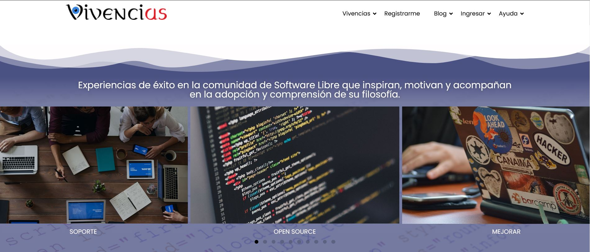

Vivencius
============
Te doy la bienvenida a nuestro portal
-------------------------
Agradezco que te estés interesando en recorrer este camino apasionante del Software Libre, donde se te abren muchas oportunidades para ti en aprendizaje, trabajo y relacionarte con personas de todo el mundo que conforman comunidades basadas en la filosofía de compartir conocimiento, participar en las creaciones más importantes a nivel mundial aunque no seas programador y lograr reconocimiento por tus esfuerzos.

Podrás crear tu empresa con modelo cooperativo que se adapta naturalmente cuando desarrollamos software y/u ofrecemos servicios sobre los programas con licencias permisivas, o simplemente si quieres cambiar por aplicaciones libres de ofimáticas, bases de datos, navegadores, etc. que poseen características muchas veces mayores que las aplicaciones privativas, donde solo adquieres el derecho de uso pero no la propiedad del programa.

Dicho esto, te comento cuál es la intención de crear un sitio que en primera instancia, si no conoces nada de Software Libre, te vayas formando un idea hacia donde apunta eso del término “Libre” y un poco cuál es la filosofía que se transmite sin hacer fundamentalismo. 

En segundo lugar mostrar que si nos animamos a salir de esa zona de confort podemos lograr cambios positivos para nosotras/os y nuestro entorno, los videos que exponemos muestran personas, muchas reconocidas hoy a nivel mundial, que fueron iniciadoras de un cambio con impactos a nivel mundial, en su entorno o en sus vidas. 

En tercer lugar y no menos importante, exponer experiencias de gente exitosa que eligió el camino de software libre, no teniendo como finalidad el dinero sino por la satisfacción de ser protagonista de algo, de decidir, de compartir, de aprender, de aportar en un cambio cultural y demás.

Teniendo todo este material y habiendo fortalecido las bases del software libre hemos organizado un blog para que cada persona pueda exponer y compartir sus vivencias, sean buenas o malas, en caso de las negativas, como lograron superarlas, para que las/os demás vean su historia y tengan la posibilidad también de ponerse en contacto, con el consentimiento de la misma.

Otra finalidad de formar una pequeña comunidad de vivencias en temas de cooperativas, desarrollo de software, educación, negocios, etc., donde el eje central sea el software libre en esos ambientes, es que podamos interactuar con personas más experimentadas que nos puedan brindar alguna experiencia puntual de ellas/os o vivencia de otras personas que nos hagan llegar y porque no, que confluyan experiencias para generar algo nuevo.

Reitero mi agradecimiento y espero que los contenidos del sitio te sean de mucha utilidad para ser parte del cambio cultural hacia un software libre donde los beneficios sean compartidos por la comunidad y mostrar las grandes ventajas que tenemos ante un software privativo.

Saludos cordiales.
Grupo Vivencius.

-------------------------

### Contribuir

Si deseas contribuir al desarrollo de este portal, ya sea en su diseño gráfico, funcionalidades, difundiendo el proyecto, traducir en otros idiomas o como expositor para dar contenido al sitio, etc. te pido que nos contactes a [Administrador Vivencius](mailto:admin@vivencius.ar)

-------------------------

### Requisitos de Sistema

* PHP: 8.0+
* MySQL: 8.0+ (o MariaDB versión 11.0+)
* WordPress: 6.0+

--------------------------

### A tener en cuenta 

* Cuando clones el repositorio en tu equipo local, tendrás disponible el archivo de la base de datos `c2122128_wordpre.sql.gz`, comprimido para que puedas importarlo directamente. De esta manera, este proceso no debería generar errores por exceso en el tiempo de ejecución.

* Debes configurar en __PhpMyAdmin__ un usuario y clave para el acceso a la base de datos, si aún no lo has hecho, para que puedas realizar todas las operaciones que requiere Wordpress.

* Recuerda configurar correctamente el archivo `wp-config.php` dentro del proyecto en las líneas `define( 'DB_USER', 'admin' );` con el usuario y define`( 'DB_PASSWORD', 'admin1234' );` con la contraseña correcta que hayas establecido para el usuario mencionado en el punto anterior.

-------------------------

### Registro de Cambios

#### 0.1.2 - Noviembre 2023

* Actualización, Creación y Codificación de varias páginas web en PHP, HTML y CSS conservando la seguridad ofrecida por los plugin y el acabado profesional del CMS Wordpress.

Desarrollador [@mayuti](https://github.com/mayuti)

#### 0.1.1 - Septiembre 2023

* Mejoras en logo, sección redes sociales, imágenes y redacciones.

Desarrollador [@mayuti](https://github.com/mayuti)

#### 0.1.0 - Agosto 2023

* Lanzamiento inicial

Desarrollador [@mayuti](https://github.com/mayuti)
